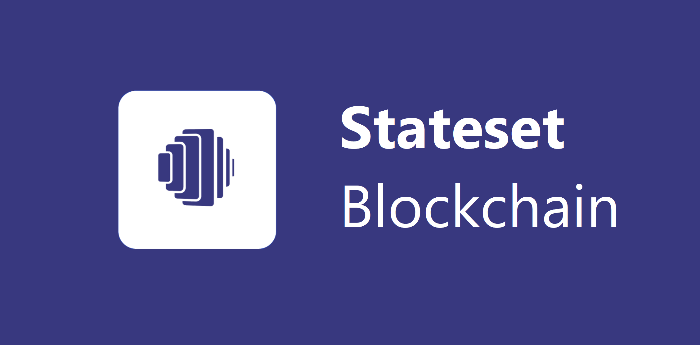

# Stateset Blockchain Network

[](https://opensource.org/licenses/Apache-2.0)

Stateset proof-of-stake blockchain based on the Cosmos SDK and Tendermint.



<br/>

## What is Stateset?

**[Stateset](https://stateset.io)** is a blockchain protocol that provides a common base for decentralized commerce finance (DeComFi). The Stateset blockchain Liquidity Pools (LPs) are used for purchase order financing and invoice factoring where users can participate as lenders or borrowers. Smart contracts on Stateset run on WebAssembly.

**Stateset Core** is the reference implementation of the Stateset protocol, written in Golang. Stateset is built atop [Cosmos SDK](https://github.com/cosmos/cosmos-sdk) and uses [Tendermint](https://github.com/tendermint/tendermint) BFT consensus. If you intend to work on Stateset Core source, it is recommended that you familiarize yourself with the concepts in those projects.


## Installation

1. Install Go by following the [official docs](https://golang.org/doc/install). 

**Go version must be 1.13+**.

2. Install the Stateset Binaries

```bash
git clone https://github.com/stateset/stateset-blockchain.git
cd stateset-blockchain
make install
```

This creates:

`statesetd`: Stateset blockchain daemon

`statesetcli`: Stateset blockchain client. Used for creating keys, send transactions, query the blockchain and underlying Tendermint node.


```bash

$ statesetd version --long
$ statesetcli version --long

```
`statesetcli` should output:

```bash

name: stateset
server_name: statesetd
client_name: statesetcli
version: 0.0.1
commit: 2f123333312331123123213
build_tags: dev,mainnet,ledger
go: go version go1.12.5 darwin/amd64

```

## Getting Started

## Run a single node

```bash

# Build the binaries
make build

# Create a wallet and save the mnemonic and passphrase
make create-wallet

# Initialize configuration files and genesis file
# Enter passphrase from above
make init

# Start the chain
make start

```

## Setting up a Node environment

```bash
statesetd init <your_custom_moniker>
```

::: warning Note
Monikers can contain only ASCII characters. Using Unicode characters will render your node unreachable.
:::

You can edit this `moniker` later, in the `~/.statesetd/config/config.toml` file:

```toml
# A custom human readable name for this node
moniker = "<your_custom_moniker>"
```

You can edit the `~/.statesetd/config/statesetd.toml` file in order to enable the anti spam mechanism and reject incoming transactions with less than the minimum gas prices:

```
# This is a TOML config file.
# For more information, see https://github.com/toml-lang/toml

##### main base config options #####

# The minimum gas prices a validator is willing to accept for processing a
# transaction. A transaction's fees must meet the minimum of any denomination
# specified in this config (e.g. 10uatom).

minimum-gas-prices = ""
```

Your full node has been initialized! 

## Genesis & Seeds

### Copy the Genesis File

Fetch the mainnet's `genesis.json` file into `statesetd`'s config directory.

```bash
mkdir -p $HOME/.statesetd/config
curl https://raw.githubusercontent.com/cosmos/launch/master/genesis.json > $HOME/.statesetd/config/genesis.json
```

Note we use the `latest` directory in the [launch repo](https://github.com/cosmos/launch) which contains details for the mainnet like the latest version and the genesis file. 

::: tip
If you want to connect to the public testnet instead, click [here](./join-testnet.md)
:::

To verify the correctness of the configuration run:

```bash
statesetd start
```

### Add Seed Nodes

Your node needs to know how to find peers. You'll need to add healthy seed nodes to `$HOME/.statesetd/config/config.toml`. The [`launch`](https://github.com/stateset/launch) repo contains links to some seed nodes.

If those seeds aren't working, you can find more seeds and persistent peers on a Stateset Hub explorer (a list can be found on the [launch page](https://stateset.network/launch)). 


## A Note on Gas and Fees

::: warning
On Statest Hub mainnet, the accepted denom is `ustate`, where `1state = 1.000.000ustate`
:::

Transactions on the Stateset Hub network need to include a transaction fee in order to be processed. This fee pays for the gas required to run the transaction. The formula is the following:

```
fees = ceil(gas * gasPrices)
```

The `gas` is dependent on the transaction. Different transaction require different amount of `gas`. The `gas` amount for a transaction is calculated as it is being processed, but there is a way to estimate it beforehand by using the `auto` value for the `gas` flag. Of course, this only gives an estimate. You can adjust this estimate with the flag `--gas-adjustment` (default `1.0`) if you want to be sure you provide enough `gas` for the transaction. 

The `gasPrice` is the price of each unit of `gas`. Each validator sets a `min-gas-price` value, and will only include transactions that have a `gasPrice` greater than their `min-gas-price`. 

The transaction `fees` are the product of `gas` and `gasPrice`. As a user, you have to input 2 out of 3. The higher the `gasPrice`/`fees`, the higher the chance that your transaction will get included in a block. 

::: tip
For mainnet, the recommended `gas-prices` is `0.025ustate`. 
::: 

## Set `minimum-gas-prices`

Your full-node keeps unconfirmed transactions in its mempool. In order to protect it from spam, it is better to set a `minimum-gas-prices` that the transaction must meet in order to be accepted in your node's mempool. This parameter can be set in the following file `~/.stated/config/gaiad.toml`.

The initial recommended `min-gas-prices` is `0.025ustate`, but you might want to change it later. 

## Run a Full Node


```
    _____       _____                 _____
    _________  /______ __  /___________________  /_
    __  ___/  __/  __ `/  __/  _ \_  ___/  _ \  __/
    _(__  )/ /_ / /_/ // /_ /  __/(__  )/  __/ /_
    /____/ \__/ \__,_/ \__/ \___//____/ \___/\__/


                ^  +-------------------------------+  ^
                |  |                               |  |
                |  |  State-machine = Application  |  |
                |  |                               |  |   Built with Cosmos SDK
                |  |            ^      +           |  |
                |  +----------- | ABCI | ----------+  v
                |  |            +      v           |  ^
                |  |                               |  |
Blockchain Node |  |           Consensus           |  |
                |  |                               |  |
                |  +-------------------------------+  |   Tendermint Core
                |  |                               |  |
                |  |           Networking          |  |
                |  |                               |  |
                v  +-------------------------------+  v

```

### Full Node
A full-node is a program that fully validates transactions and blocks of a blockchain. It is distinct from a light-node that only processes block headers and a small subset of transactions. Running a full-node requires more resources than a light-node but is necessary in order to be a validator. In practice, running a full-node only implies running a non-compromised and up-to-date version of the software with low network latency and without downtime.


Start the full node with this command:

```bash
statesetd start
```

Check that everything is running smoothly:

```bash
statesetcli status
```

View the status of the network with the [Stateset Explorer](https://stateset.network/launch).

## Upgrade to Validator Node

You now have an active full node. What's the next step? You can upgrade your full node to become a Stateset Validator. The top 100 validators have the ability to propose new blocks to the Stateset Hub.


### Validator Node
The Stateset Blockchain is based on Cosmos SDK and Tendermint, which relies on a set of validators to secure the network. The role of validators is to run a full-node and participate in consensus by broadcasting votes which contain cryptographic signatures signed by their private keys. Validators commit new blocks to the blockchain and receive revenue in exchange for their work. They must also participate in governance by voting on proposals. Validators are weighted according to their total stake.

#Validator Candidate Node

```jsx

statesetcli stake create-validator \
    --pubkey=$(stateset tendermint show-validator) \
    --moniker=<your-validator-name> \
    --amount=<amount-to-be-delegated, e.g. 10000state> \
    --commission-rate=0.1 \
    --gas=100000 \
    --fee=0.6state \
    --chain-id=statesethub \
    --from=<key-name> \
    --commit

```

### Validator Risks

Unavailability: Validators are expected to keep signing votes for making new blocks. If a validator's signature has not been included in more than 30% of the last 34,560 blocks (which amounts to approximately 48 hours, assuming an average block-generating time of 5 seconds), this validator will get jailed and removed from current validatorset for 1.5 day, and their bonded tokens will get slashed by 0.03%.

Double Sign: If the protocol detects that a validator voted multiple different opinions about the same block (same height/round), or voted for different blocks at the same height/round, this validator will get jailed and removed from current validatorset for 2 days. Their bonded tokens will get slashed by 1%.

Censorship: If the protocol detects that a proposer included invalid transactions in a block, this validator will get jailed and removed from current validatorset for 2 days.
All metrics mentioned can be adjusted by parameter-change proposals.


## Export State

Stateset can dump the entire application state to a JSON file, which could be useful for manual analysis and can also be used as the genesis file of a new network.

Export state with:

```bash
statesetd export > [filename].json
```

You can also export state from a particular height (at the end of processing the block of that height):

```bash
statesetd export --height [height] > [filename].json
```

If you plan to start a new network from the exported state, export with the `--for-zero-height` flag:

```bash
statesetd export --height [height] --for-zero-height > [filename].json
```

## Verify Mainnet 

Help to prevent a catastrophe by running invariants on each block on your full
node. In essence, by running invariants you ensure that the state of mainnet is
the correct expected state. One vital invariant check is that no atoms are
being created or destroyed outside of expected protocol, however there are many
other invariant checks each unique to their respective module. Because invariant checks 
are computationally expensive, they are not enabled by default. To run a node with 
these checks start your node with the assert-invariants-blockly flag:

```bash
statesetd start --assert-invariants-blockly
```

If an invariant is broken on your node, your node will panic and prompt you to send
a transaction which will halt mainnet. For example the provided message may look like: 

```bash
invariant broken:
    loose token invariance:
        pool.NotBondedTokens: 100
        sum of account tokens: 101
    CRITICAL please submit the following transaction:
        statesetcli tx crisis invariant-broken factoring supply

```

When submitting a invariant-broken transaction, transaction fee tokens are not
deducted as the blockchain will halt (aka. this is a free transaction). 
